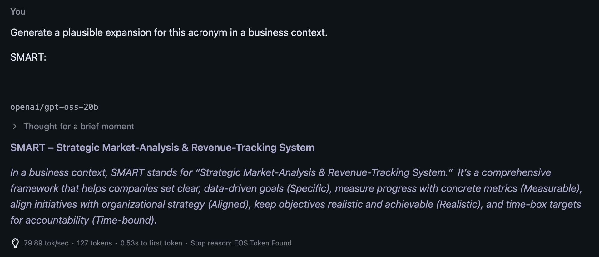
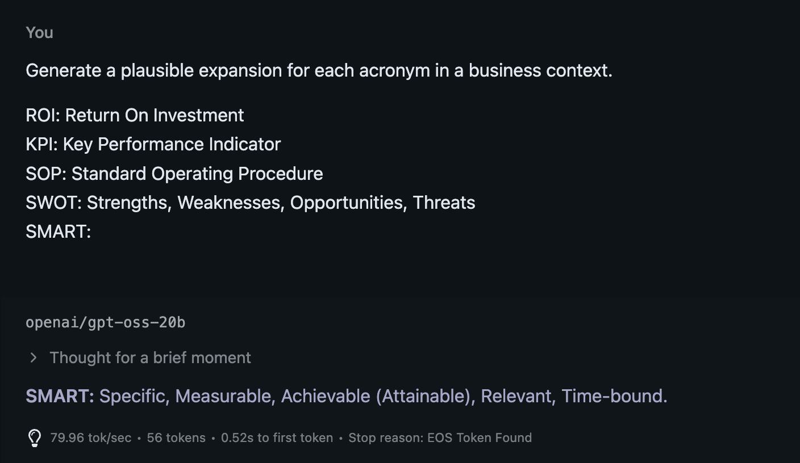
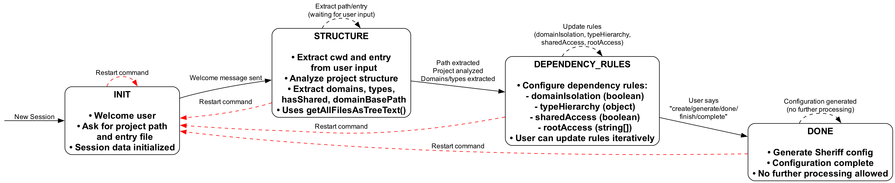
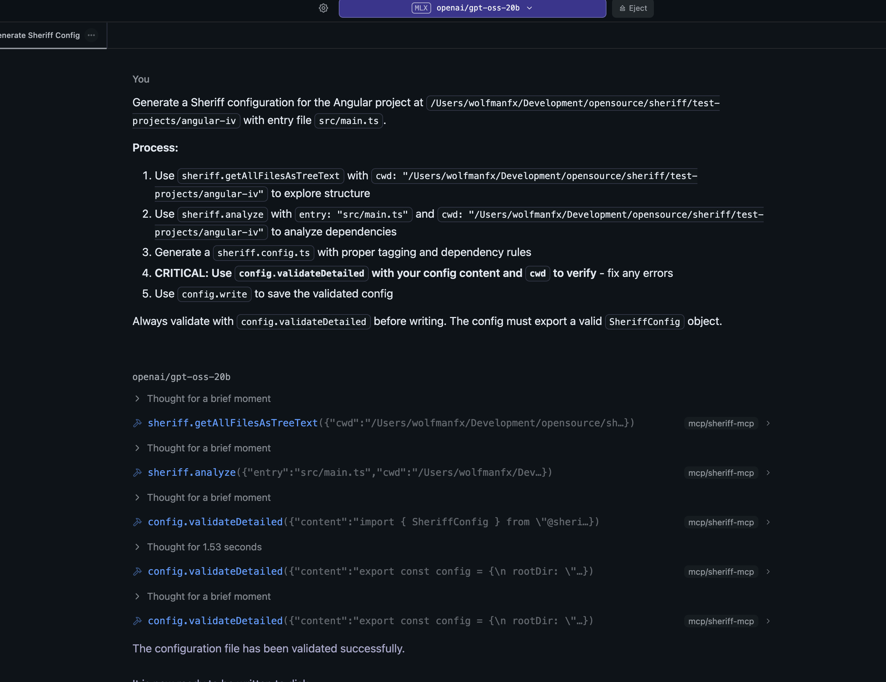

# AI-Assisted Sheriff Configuration Generation

## Motivation

[**Sheriff**](https://sheriff.softarc.io/) is a tool designed to **protect your software architecture**.
It lets you define *tags* at the folder level (manually or automatically) and uses these tags to **restrict which modules can access other modules**.

In practice, developers often rely less on traditional documentation, a trend amplified by the accessibility of conversational LLM interfaces. To improve Sheriff's adoption, we explored how **AI could automatically create a valid starting configuration**, helping new users get onboarded faster and more reliably.

Creating a Sheriff configuration requires understanding both architectural intent and code structure, which makes it a suitable candidate for structured LLM assistance.

---

## Approaches

The central question we asked was:

> **How can we use AI to produce a valid Sheriff configuration as a reliable starting point?**

One promising direction is **structured prompting with In-Context Learning (ICL)** — a technique where examples are embedded directly into the prompt so the model can infer the pattern and generalize.

Structured prompting refers to embedding structured context — documentation, examples, and constraints — within the system prompt. This aligns with comprehensive surveys of prompt engineering techniques (*[Liu et al., 2024](https://arxiv.org/abs/2402.07927)*), which categorize and analyze various prompting strategies for large language models.

The concept is discussed in *[Are Emergent Abilities in Large Language Models Just In-Context Learning?](https://arxiv.org/html/2309.01809v2)* (Lu et al., 2023), which discusses ICL as the phenomenon by which models can learn task behavior from a few examples without parameter updates.
However, the paper also cautions that overreliance on these perceived abilities can lead to **hallucinations** or **inaccurate outputs** when examples are sparse or ambiguous.

**Terminology note:** In this document, we distinguish between **few-shot learning** (multiple examples provided in context) and **one-shot learning** (a single example). Both are forms of ICL, differing only in the number of demonstrations provided.

---

### Example: The Impact of In-Context Learning

To illustrate ICL’s importance, consider a simple task: expanding the acronym **SMART**, which correctly stands for
**S**pecific, **M**easurable, **A**chievable (or Attainable), **R**elevant, **T**ime-bound.


I tested this with a small, locally hosted model (gpt-oss-20b) where I limited reasoning capability.

**Without ICL** (no contextual examples provided):



The model produced an incorrect expansion.

**With ICL** (clear examples included in the prompt):



The model now produced the correct result.
This simple demonstration shows how including examples directly in the prompt can dramatically improve structured output quality — a key insight when asking an LLM to generate Sheriff configurations.

---

## The Role of Reasoning in LLMs

Beyond examples, another powerful prompting strategy is encouraging the model to **reason step-by-step** before giving its final answer.

This idea is formalized in *[Chain-of-Thought Prompting Elicits Reasoning in Large Language Models](https://arxiv.org/abs/2201.11903)* (Wei et al., 2022), which demonstrates that prompting models to "think aloud" significantly improves performance on complex or multi-step problems.

It's important to note that reasoning is a prompting strategy, not a fine-tuning process — it leverages internal attention mechanisms to simulate logical sequences.

### Why Reasoning Helps

By generating intermediate reasoning steps, the model can:

* Break complex problems into smaller, manageable pieces
* Verify its own logic before committing to an answer
* Catch potential inconsistencies early
* Handle multi-stage tasks that require sequential decision-making

For example, when analyzing a codebase to generate a Sheriff configuration, a reasoning-enabled model might first:

1. Identify the project structure and key modules
2. Analyze dependencies between modules
3. Determine logical architectural boundaries
4. Suggest appropriate tag hierarchies
5. Finally, generate the configuration based on this structured analysis

Recent models — such as OpenAI's *o1* series and Anthropic's *Claude 3.5 Sonnet* with extended thinking capabilities — have been trained specifically to extend reasoning depth, showing remarkable improvements on such analytical tasks.

---

### ⚖️ The Trade-Off: Token Consumption and Cost

Reasoning comes with a cost. When an LLM "thinks through" a task, it generates more text (tokens), which increases:

* **Token consumption** — Empirical studies indicate that chain-of-thought (CoT) reasoning typically increases token usage between 2× and 3× compared to direct prompting ([Coda et al., 2024](https://arxiv.org/abs/2401.05618)). In complex scenarios, studies using the TALE (Token-Budget-Aware LLM Reasoning) framework achieved up to 68.64% token reduction compared to unrestricted CoT reasoning, suggesting baseline CoT can consume 3× or more tokens ([Han et al., 2024](https://arxiv.org/abs/2412.18547)).

* **Response time** — Empirical studies show dramatic latency differences: GPT-4o takes 21.37 seconds to generate a response with CoT prompting, whereas it answers the same question without CoT in 2.81 seconds—achieving an almost 10× speedup when reasoning is removed ([Compressed CoT, 2024](https://arxiv.org/abs/2412.13171)).

* **API cost** — Real-world cost analysis shows that Concise CoT (a compressed reasoning approach) produced total cost savings of 21.85% for GPT-3.5 and 23.49% for GPT-4, demonstrating that standard CoT incurs approximately 20-25% higher costs ([Coda et al., 2024](https://arxiv.org/abs/2401.05618)).

For the **Sheriff AI agent**, this means balancing two competing goals:

* **Quality:** Reasoning leads to more accurate, well-structured configurations
* **Efficiency:** More tokens mean higher costs and slower responses

The optimal strategy is to use **reasoning selectively**:

* Enable it for complex or enterprise-scale projects
* Disable it for small or simple repositories where ICL alone is sufficient

---

## Application to Sheriff - Approach 1

Our first approach implements **structured prompting with In-Context Learning** — a straightforward yet effective strategy that embeds Sheriff's documentation and examples directly into the system prompt.

### Architecture

The implementation consists of a single Express router (`structured-prompt-router.ts`) that exposes one endpoint:

1. **`/chat`** — A conversational endpoint for interactive configuration assistance

The endpoint leverages the [Vercel AI SDK](https://sdk.vercel.ai/docs) for streaming responses, ensuring a responsive user experience even with longer generation tasks. Users can engage in a natural conversation to generate Sheriff configurations, ask questions, or refine existing configs.

### In-Context Learning in Practice

**Approach 1 is fundamentally built on In-Context Learning (ICL)** — the technique where examples are embedded directly into the prompt so the model can infer patterns and generalize to new tasks.

The core of Approach 1 is the `SHERIFF_DOCS` constant — a documentation snippet that gets embedded directly into every system prompt:

```5:62:apps/sheriff-api/src/approach-1/structured-prompt-router.ts
const SHERIFF_DOCS = `
# Sheriff Configuration Documentation

Sheriff enforces module boundaries and dependency rules in TypeScript.

## Key Concepts:

1. **Modules**: Define your project structure
   - Use path patterns: 'src/app/<domain>/<type>'
   - Assign tags: ['domain:<domain>', 'type:<type>']

2. **Dependency Rules (depRules)**:
   - Define which tags can access other tags
   - Format: { 'tag': 'allowedTag' } or { 'tag': ['tag1', 'tag2'] }

3. **Domain Isolation**:
   - Use 'domain:*': [sameTag, 'shared'] for strict isolation
   - sameTag is a built-in function that ensures same domain access

4. **Type Hierarchy**:
   - Define access patterns: 'type:feature': ['type:data', 'type:ui', 'type:model']
   - Higher-level types can depend on lower-level types

5. **Shared Modules**:
   - Tag with 'shared': 'shared'
   - Accessible by all domains

6. **Root Module**:
   - Automatically tagged with 'root'
   - Usually can access feature modules: 'root': 'type:feature'

## Example Config:

\`\`\`typescript
import { sameTag, SheriffConfig } from '@softarc/sheriff-core';

export const config: SheriffConfig = {
  modules: {
    'src/app/<domain>/<type>': ['domain:<domain>', 'type:<type>'],
  },
  depRules: {
    'domain:*': [sameTag, 'shared'],
    'type:feature': ['type:data', 'type:ui', 'type:model'],
    'type:data': 'type:model',
    'type:ui': 'type:model',
    'shared': 'shared',
    'root': ['type:feature', 'shared'],
  },
};
\`\`\`

## Common Patterns:

- **Domain-Driven Design**: Isolate domains, allow access to shared
- **Layered Architecture**: Feature -> Data -> Model hierarchy
- **Monorepo**: Use entryPoints for multiple apps
- **Barrel-less**: Use enableBarrelLess: true with internal folders
`;
```

#### How ICL Works in Approach 1

The `SHERIFF_DOCS` constant implements **one-shot prompting**, a form of example-based In-Context Learning, by providing:

1. **Conceptual examples** — The "Key Concepts" section teaches the model Sheriff's vocabulary and rules
2. **Concrete demonstration** — The complete TypeScript configuration example shows the exact format and structure expected
3. **Pattern templates** — The "Common Patterns" section provides architectural blueprints the model can adapt

When a user asks the model to generate a Sheriff config, the model doesn't need to "know" Sheriff's syntax from training — instead, it **learns from context** by observing the embedded examples. This is ICL in action: the model sees the example configuration, understands the pattern, and applies it to the user's specific project structure.

As discussed earlier, this mirrors the SMART acronym example: without ICL (no examples), the model might hallucinate incorrect syntax. With ICL (as shown in the `SHERIFF_DOCS` examples), the model reliably produces syntactically correct TypeScript configurations that follow Sheriff's conventions.

By including:
- Key concepts and terminology
- A complete, syntactically correct example configuration
- Common architectural patterns

We give the model a clear template to follow, dramatically reducing the likelihood of hallucinations or incorrect syntax.

### System Prompt Design

The system prompt combines role definition, task instructions, and the embedded documentation:

```64:77:apps/sheriff-api/src/approach-1/structured-prompt-router.ts
const SYSTEM_PROMPT = `You are an expert in Sheriff configuration for TypeScript projects. Sheriff enforces module boundaries and dependency rules.

Your task is to help users generate Sheriff configuration files based on their project structure and requirements.

When generating configs:
1. ALWAYS start with: import { sameTag, SheriffConfig } from '@softarc/sheriff-core';
2. Use the exact TypeScript format shown in the documentation
3. Include helpful comments explaining the rules
4. Use placeholders like <domain> and <type> for scalable configs
5. Ensure the config is syntactically correct TypeScript
6. When asked to generate a config, output ONLY the TypeScript code
7. Be conversational when answering questions, but precise when generating code

${SHERIFF_DOCS}`;
```

Notice the explicit instructions (steps 1–7) combined with the embedded examples. This dual approach — **instructional guidance** plus **concrete examples** — leverages both the model's ability to follow directions and its ICL capabilities.

### Theoretical Foundations

Approach 1 synthesizes several key prompting techniques from recent research:

**Instruction-Based Prompting** — The explicit separation of system instructions from user inputs ensures task focus and LLM alignment, as demonstrated by *[Language Models are Few-Shot Learners](https://arxiv.org/abs/2005.14165)* (Brown et al., 2020). Our `SYSTEM_PROMPT` clearly defines the model's role and constraints, while user messages contain the specific task.

**One-Shot Example-Based Prompting** — The `SHERIFF_DOCS` constant embeds a single comprehensive example directly in the context, serving as a demonstration that guides the model's output format. This is **one-shot learning** (a single example), as opposed to **few-shot learning** (multiple examples). Both approaches leverage example-based prompting, as discussed in *[Chain-of-Thought Prompting Elicits Reasoning in Large Language Models](https://arxiv.org/abs/2201.11903)* (Wei et al., 2022), which shows that including exemplars significantly improves structured output quality.

**System-User Separation** — By maintaining a clear boundary between system-level instructions (the `SYSTEM_PROMPT`) and user-level requests (project structure and requirements), we ensure the model maintains consistent behavior across conversations. This architectural pattern, foundational to modern LLM APIs, was established in *[Language Models are Few-Shot Learners](https://arxiv.org/abs/2005.14165)* (Brown et al., 2020) — the GPT-3 paper — and remains critical for reliable prompt engineering.

### Future Extensions

While Approach 1 focuses on the foundational techniques above, several advanced methods from recent research could enhance future iterations:

**Self-Consistency** — As explored by *[Self-Consistency Improves Chain-of-Thought Reasoning](https://arxiv.org/abs/2203.11171)* (Wang et al., 2022), generating multiple reasoning paths and selecting the most consistent answer could improve reliability for complex projects. This would involve sampling multiple configurations and selecting the most consistent one through majority voting or consistency scoring between the samples themselves.

**Hierarchical Task Routing** — Following *[A Survey on In-Context Learning](https://arxiv.org/abs/2301.00234)* (Dong et al., 2023), the router could act as a controller that maps high-level goals to specialized sub-prompts. For example, different architectural patterns (monorepo vs. single-app, DDD vs. layered) could trigger different prompt templates.

**Dynamic Retrieval Augmentation** — As demonstrated in *[Retrieval-Augmented Generation](https://arxiv.org/abs/2005.11401)* (Lewis et al., 2020), the router could dynamically append external data — such as actual dependency graphs, existing configs from similar projects, or real-time codebase analysis — to enrich the context beyond static examples.

**Chain-of-Thought Abstraction** — The model could preserve multi-step reasoning in structured form (as discussed in Wei et al., 2022), allowing the system to reuse logical sequences when generating similar configurations.

These techniques represent the next evolution beyond Approach 1's simplicity, trading increased complexity and token cost for potentially higher accuracy on challenging projects.

### Implementation Details

The `/chat` endpoint uses the Vercel AI SDK's `streamText` function with key configuration:

```98:102:apps/sheriff-api/src/approach-1/structured-prompt-router.ts
      const result = streamText({
        model,
        messages: messagesWithSystem,
        temperature: 0.3,
      });
```

Key design decisions:

- **Temperature: 0.3** — Lower temperature for more deterministic, consistent outputs. This is crucial for generating code where correctness matters more than creativity.
- **Streaming responses** — Uses `pipeUIMessageStreamToResponse` to provide real-time feedback, improving perceived performance.
- **System message injection** — Ensures the system prompt (with ICL examples) is always present, even if the client doesn't provide one.
- **Conversational interface** — The single `/chat` endpoint handles both questions and configuration generation, allowing users to iteratively refine their configs through natural dialogue.

### Example Usage

A demonstration of Approach 1 in action using the Gemini 2.5 Flash API is available [here](https://share.cleanshot.com/8Ww9lGXr). This video shows how the structured prompting approach with In-Context Learning enables the model to generate valid Sheriff configurations through natural conversation, demonstrating the effectiveness of embedding documentation and examples directly in the system prompt.


## Application to Sheriff - Approach 2

While Approach 1 demonstrates the power of simple In-Context Learning, real-world configuration tasks often benefit from a more structured, conversational approach. **Approach 2 implements a multi-state conversational agent** that guides users through Sheriff configuration using task decomposition and iterative refinement.

### Architecture

Approach 2 is built around a **finite state machine** that breaks the configuration process into discrete, manageable stages. This design reflects the research on task decomposition, particularly *[Least-to-Most Prompting](https://arxiv.org/abs/2205.10625)* (Zhou et al., 2022), which demonstrates that complex problems are better solved by breaking them into sequential subproblems.

The implementation consists of several key components:

**Core Router** (`conversational-agent-router.ts`):

```29:50:apps/sheriff-api/src/approach-2/conversational-agent-router.ts
  router.post('/chat', async (req: Request, res: Response) => {
    const { messages, sessionId } = req.body;
    const context: ChatHandlerContext = { sessions, model };

    // Process chat message through state machine
    const response = await handleChatMessage(
      { messages: messages as UIMessage[], sessionId },
      context,
    );

    // Stream response through presentation LLM for natural output
    const result = streamText({
      model,
      system: 'Present information clearly and conversationally...',
      messages: [{ role: 'user', content: response.message }],
      temperature: 0.3,
    });
```

**State Machine** (`conversational-state-machine.ts`):

- Manages state transitions (INIT → STRUCTURE → DEPENDENCY_RULES → DONE)
- Orchestrates state-specific handlers
- Maintains session data across conversations
- Coordinates final config generation

**State Handlers**:

- `init-state-handler.ts` - Welcomes user and gathers initial information
- `structure-state-handler.ts` - Analyzes project structure and extracts domains/types
- `dependency-rules-state-handler.ts` - Iteratively refines dependency rules

### The State Machine Flow



*Figure 1: State Machine Flow for Sheriff AI Configuration (Approach 2)*

Approach 2 guides users through four distinct states:

#### 1. **INIT State**

The entry point that welcomes users and requests essential project information:

```20:26:apps/sheriff-api/src/approach-2/state-handlers/init-state-handler.ts
    example: {
      data: {},
      nextState: 'STRUCTURE',
      message: 'Welcome! 🛡️ To configure Sheriff, I need:\n1. The root path of your project (e.g., /Users/name/project)\n2. The entry file path (e.g., src/main.ts or src/index.ts)\n\nPlease provide both:',
    },
```

This state ensures users provide the minimum information needed before proceeding.

#### 2. **STRUCTURE State**

This state performs three critical operations:

**Path Extraction** - Uses structured outputs to reliably extract paths from natural language. The LLM is constrained to return a JSON object matching a strict schema with `cwd` (root path) and `entry` (entry file path) fields, ensuring parseable and validated results even when users provide paths in various formats:

```59:75:apps/sheriff-api/src/approach-2/state-handlers/structure-state-handler.ts
function createExtractPathPrompt(input: string): StatePromptConfig {
  return {
    system: 'Extract the root path (cwd) and entry file path from user input.',
    user: input,
    schema: {
      data: { cwd: 'string', entry: 'string' },
      nextState: 'string',
      message: 'string',
    },
    example: {
      data: { cwd: '/Users/.../project', entry: 'src/main.ts' },
      nextState: 'STRUCTURE',
      message: '✅ Got it! Analyzing project structure...',
    },
  };
}
```

**Project Analysis** - Calls the actual Sheriff analysis tool:

```typescript
const analysisResult = getAllFilesAsTreeText(session.entry, session.cwd);
session.analysisResult = analysisResult;
```

**Domain/Type Extraction** - After receiving the analysis result, the system uses another LLM call to extract architectural patterns. The prompt instructs the model to identify domains from tags like `domain:bookings`, extract types from tags like `type:feature`, detect whether a shared folder exists, and determine the base path where domains are located (e.g., `src/app`). The LLM returns structured data including arrays of unique domains and types, a boolean indicating shared folder presence, and the domain base path. This structured extraction enables the system to understand the project's architecture before proceeding to dependency rule configuration.

This demonstrates reasoning–action interleaving, a core principle of the ReAct framework (*[Yao et al., 2022](https://arxiv.org/abs/2210.03629)*), where the LLM not only reasons but also interacts with external tools (the Sheriff analyzer).

#### 3. **DEPENDENCY_RULES State**

The most interactive state, allowing iterative refinement of dependency rules. Using structured outputs, the system extracts updates to four key rule categories: `domainIsolation` (boolean indicating whether domains should be isolated), `typeHierarchy` (object mapping types to their allowed dependencies), `sharedAccess` (boolean for shared folder access), and `rootAccess` (array of types root can access). The prompt includes the current rules summary, enabling users to refine configurations incrementally. The system detects when users signal completion (via keywords like "create", "generate", "done") and transitions to the DONE state. **Key design decision:** The system stays in this state until the user explicitly says "create config" or similar, enabling multiple rounds of refinement. This iterative approach aligns with **self-consistency** principles, where multiple reasoning iterations lead to better outcomes.

#### 4. **DONE State**

Triggers the final configuration generation. When the session reaches the DONE state, the system calls `generateConfig` with all collected session data (domains, types, dependency rules, etc.). The function uses a heavily constrained prompt (discussed in the Configuration Generation section) to produce a valid Sheriff configuration file. The generated TypeScript config is wrapped in a code block and returned to the user. Error handling ensures that if generation fails, a clear error message is displayed rather than crashing the session.

### Theoretical Foundations

Approach 2 synthesizes several advanced prompting techniques:

**Task Decomposition (Least-to-Most Prompting)** - The state machine explicitly decomposes the complex task of "generate a Sheriff config" into four sequential subtasks. As demonstrated by *[Zhou et al., 2022](https://arxiv.org/abs/2205.10625)*, this decomposition enables the model to handle each piece with greater accuracy than attempting the full task at once.

**Tool-Augmented Reasoning (ReAct)** - Following *[Yao et al., 2022](https://arxiv.org/abs/2210.03629)*, Approach 2 interleaves reasoning (LLM prompts) with actions (calling `getAllFilesAsTreeText`). The STRUCTURE state exemplifies this pattern:

1. **Reason**: Extract paths from user input
2. **Act**: Analyze project with Sheriff tool
3. **Reason**: Extract domains/types from analysis result
4. **Act**: Transition to next state

**Hierarchical Task Routing** - The state machine acts as a controller that routes requests to specialized sub-handlers, each with domain-specific prompts. This aligns with *[A Survey on In-Context Learning](https://arxiv.org/abs/2301.00234)* (Dong et al., 2023), which discusses prompt selection as a form of hierarchical control.

**Structured Output Generation** - All state handlers use strict JSON schemas to ensure parseable, validated outputs. This approach aligns with modern API patterns such as OpenAI's function calling (*[OpenAI, 2023](https://openai.com/index/function-calling-and-other-api-updates/)*), which enforces structured outputs through schema definitions:

```typescript
export const MAIN_PROMPT = `You are a state machine controller.

CRITICAL: YOUR RESPONSE MUST BE VALID JSON ONLY.
- Output ONLY valid JSON, nothing else
- Do NOT include markdown code blocks

Schema: { "data": {...}, "nextState": "STATE_NAME", "message": "..." }`;
```

This strict enforcement prevents hallucinations and ensures reliable state transitions - a critical requirement for deterministic systems.

### Configuration Generation

The final step uses a heavily constrained prompt to prevent hallucinations:

```20:51:apps/sheriff-api/src/approach-2/config-generation-prompts.ts
export const CONFIG_GENERATION_PROMPT = `# Sheriff Configuration Generator - Strict Mode

## CRITICAL CONSTRAINTS

### ⚠️ VALID PROPERTIES ONLY
SheriffConfig accepts: modules, depRules, enableBarrelLess, autoTagging, excludeRoot, version

**NEVER ADD THESE (they do NOT exist):**
- ❌ domainIsolation, typeHierarchy, sharedAccess, rootAccess

### 🔑 MANDATORY PLACEHOLDER USAGE
**ALWAYS use placeholders \`<domain>\` and \`<type>\` in module paths.**
- ✅ CORRECT: \`'src/app/<domain>/<type>'\`
- ❌ WRONG: \`'src/app/customer/feature'\`
```

This extreme specificity addresses a common LLM failure mode: **property hallucination**. During development, models frequently invented non-existent properties like `domainIsolation` or `typeHierarchy`. The explicit "NEVER ADD THESE" list directly counters this tendency.

### Example Usage

A demonstration of Approach 2 in action using the Gemini 2.5 Flash API is available [here](https://share.cleanshot.com/WZdHXqFq). This video showcases the multi-state conversational agent guiding users through the configuration process, demonstrating how the state machine breaks down the complex task into manageable stages (INIT → STRUCTURE → DEPENDENCY_RULES → DONE) and enables iterative refinement of dependency rules through natural dialogue.

### Approach 2 vs. Approach 1: Trade-offs

| Aspect | Approach 1 (Simple ICL) | Approach 2 (State Machine) |
|--------|-------------------------|----------------------------|
| **Complexity** | Single router, one endpoint | Multiple handlers, state management |
| **User Experience** | Single-shot generation | Guided multi-turn conversation |
| **Accuracy** | Depends on input quality | Validates and refines incrementally |
| **Token Usage** | Lower (1-2 LLM calls) | Higher (5-10+ LLM calls per session) |
| **Project Analysis** | User must provide structure | Automatically analyzes codebase |
| **Iteration** | Start over if wrong | Refine rules iteratively |
| **Tool Integration** | None | Sheriff analyzer integration |
| **Best For** | Simple projects, experienced users | Complex projects, new users |
---

## MCP Server Approach

Beyond the two prompting approaches discussed above, we also implemented a **Model Context Protocol (MCP) server** to enable Sheriff configuration generation with local LLMs and specialized AI development environments.

### What is MCP?

The **Model Context Protocol (MCP)** is an open protocol introduced by Anthropic that standardizes how AI assistants interact with external tools and data sources. MCP provides a universal, open standard for connecting AI systems with data sources, replacing fragmented integrations with a single protocol (*[Anthropic, 2024](https://www.anthropic.com/news/model-context-protocol)*). The protocol deliberately reuses message-flow ideas from the Language Server Protocol (LSP) and is transported over JSON-RPC 2.0, with stdio and HTTP as standard transport mechanisms (*[Zhao et al., 2025](https://www.preprints.org/manuscript/202504.0245/v1)*).

MCP follows a client-server architecture where:
- **MCP Servers** expose tools and resources through JSON-RPC over stdio or HTTP
- **MCP Clients** (AI assistants, IDEs, or LLM interfaces) discover and invoke these tools dynamically
- **Tool Definitions** use JSON Schema to describe inputs and outputs, enabling type-safe interactions

MCP addresses the "N×M integration problem" where as the number of AI applications (N) and tools (M) increase, the complexity of creating custom integrations for each combination becomes unmanageable (*[Zhao et al., 2025](https://www.preprints.org/manuscript/202504.0245/v1)*). Unlike conventional request-response APIs, MCP's design prioritizes persistent, real-time, bidirectional communication between AI applications and external data sources (*[IBM Research, 2025](https://www.researchgate.net/publication/389713732)*).

**Industry Adoption**: In March 2025, OpenAI officially adopted MCP, integrating it across ChatGPT desktop app, OpenAI's Agents SDK, and the Responses API, signaling its emergence as an industry standard (*[Wikipedia, 2025](https://en.wikipedia.org/wiki/Model_Context_Protocol)*).

### Theoretical Foundations

MCP builds upon established research in tool-augmented LLMs:

**Tool Learning Framework**: Recent surveys systematically review tool learning according to a taxonomy of four key stages: task planning, tool selection, tool calling, and response generation (*[Qu et al., 2024](https://arxiv.org/abs/2405.17935)*). This workflow provides the conceptual foundation for how MCP servers expose and execute tools.

**Function Calling vs. MCP**: Function calling and tool calling are used interchangeably in LLM literature, with frameworks evaluating the model's ability to invoke specific APIs when known and retrieve appropriate APIs when not known in advance (*[Quotient AI, 2025](https://blog.quotientai.co/evaluating-tool-calling-capabilities-in-large-language-models-a-literature-review/)*). Before MCP, approaches like OpenAI's 2023 function-calling API solved similar problems but required vendor-specific connectors, creating the N×M integration problem that MCP addresses through standardization.

**Tool-Augmented Scientific Reasoning**: Research on tool-augmented LLMs demonstrates that models trained on tool-use datasets with external functions achieve substantial accuracy improvements—SciAgent showed more than 13% absolute accuracy gains when tools are available (*[Ma et al., 2024](https://arxiv.org/abs/2402.11451)*).

### Why Create an MCP Server for Sheriff?

We implemented an MCP server primarily to enable **local LLM integration**. Tools like [LM Studio](https://lmstudio.ai/), [Ollama](https://ollama.ai/), and [Continue.dev](https://continue.dev/) support MCP, allowing developers to use locally hosted models for Sheriff configuration generation without relying on cloud APIs.

**Key motivations:**

1. **Privacy and Data Sovereignty** — Local deployment ensures data privacy by keeping user and proprietary data within local infrastructure, reducing third-party risk and potential data exposure (*[Weaviate, 2023](https://weaviate.io/blog/private-llm)*). This addresses concerns about data leakage and compliance with GDPR and CCPA regulations, which is critical when LLMs process sensitive PII (*[Arora et al., 2025](https://arxiv.org/abs/2501.12456)*).

2. **Cost Efficiency** — Local inference eliminates per-token API costs, making it viable for frequent iterations and experimentation

3. **Offline Capability** — Fully offline retrieval-augmented systems can operate in air-gapped environments with robust security while maintaining performance, as demonstrated in deployment studies for security-sensitive domains (*[MDPI Electronics, 2025](https://www.mdpi.com/2079-9292/14/17/3407)*)

4. **Custom Model Selection** — Recent work on teaching LLMs to use tools shows that models can be specifically trained to support standardized protocols like MCP, achieving up to 28.75% improvement in function-calling accuracy (*[Emanuilov, 2025](https://arxiv.org/abs/2506.23394)*)

### Implementation Details

Our MCP server exposes Sheriff's core operations as standardized tools:

**File System Operations:**
- `fs.list` — List directories in the workspace
- `sheriff.getAllFilesAsTreeText` — Get project structure as tree-formatted text

**Configuration Management:**
- `config.read` — Read existing `sheriff.config.ts`
- `config.previewWrite` — Validate config without writing
- `config.applyPreview` — Temporarily apply config for real-time analysis
- `config.validateDetailed` — Validate with detailed error messages
- `config.write` — Write validated config to disk

**Analysis Operations:**
- `sheriff.analyze` — Analyze project structure and dependencies
- `sheriff.allowedMatrix` — Compute allowed dependency matrix
- `sheriff.summarizeTags` — Inspect tags for specific modules
- `sheriff.moduleStructure` — Get module structure for visualization

Each tool is defined with a Zod schema that gets converted to JSON Schema for MCP compatibility, ensuring type safety and clear documentation.

### Example Usage

The following screenshot demonstrates the Sheriff MCP server in action using LM Studio, showing how a local LLM can generate a Sheriff configuration through tool-augmented reasoning:



*Figure 2: Sheriff MCP Server in LM Studio - Generating Configuration via Tool-Augmented Reasoning*

The example shows the model following a structured process:
1. Exploring project structure using `sheriff.getAllFilesAsTreeText`
2. Analyzing dependencies with `sheriff.analyze`
3. Generating a configuration based on the analysis
4. Validating the configuration using `config.validateDetailed` (critical step)
5. Writing the validated configuration to disk

Here's an example prompt that demonstrates how to use the Sheriff MCP tools effectively:

```markdown
# Quick Prompt for LLM Studio

Generate a Sheriff configuration for the Angular project at `/Users/wolfmanfx/Dev/opensource/sheriff-ai/test-projects/angular-iv` with entry file `src/main.ts`.

**Process:**
1. Use `sheriff.getAllFilesAsTreeText` with `cwd: "/Users/wolfmanfx/Dev/opensource/sheriff-ai/test-projects/angular-iv"` to explore structure
2. Use `sheriff.analyze` with `entry: "src/main.ts"` and `cwd: "/Users/wolfmanfx/Dev/opensource/sheriff-ai/test-projects/angular-iv"` to analyze dependencies
3. Generate a `sheriff.config.ts` with proper tagging and dependency rules
4. **CRITICAL: Use `config.validateDetailed` with your config content and `cwd` to verify** - fix any errors
5. Use `config.write` to save the validated config

Always validate with `config.validateDetailed` before writing. The config must export a valid `SheriffConfig` object.
```

This example demonstrates the **ReAct pattern** (Reasoning + Acting) in practice: the model reasons about the project structure, acts by calling analysis tools, reasons about the results, and acts again to generate and validate the configuration. The critical validation step ensures that the generated configuration is syntactically correct and follows Sheriff's constraints, preventing common LLM failure modes like property hallucination.

**Debugging and Testing MCP Servers**: Developers can use the **MCP Inspector** tool to test and debug MCP servers, including custom implementations like the Sheriff MCP server. The MCP Inspector provides a visual interface for inspecting tool definitions, testing tool calls, and verifying server responses. 

To start the MCP Inspector, run:

```bash
npx @modelcontextprotocol/inspector
```

A demonstration of using MCP Inspector with the Sheriff MCP server is available [here](https://share.cleanshot.com/wsDfTZQw).

---

## Supporting Research

Here are additional papers that reinforce these ideas:

| Topic                      | Paper                                                                                                                                | Key Insight                                                            |
| -------------------------- | ------------------------------------------------------------------------------------------------------------------------------------ | ---------------------------------------------------------------------- |
| Instruction-Based Prompting | [Brown et al., 2020 – *Language Models are Few-Shot Learners*](https://arxiv.org/abs/2005.14165)                                    | Explicit system + user separation ensures task focus and LLM alignment. |
| Chain-of-Thought Reasoning | [Wei et al., 2022 – *Chain-of-Thought Prompting Elicits Reasoning*](https://arxiv.org/abs/2201.11903)                                | Demonstrates large accuracy improvements on multi-step reasoning; context can include structured results as mini-demos. |
| In-Context Learning        | [Lu et al., 2023 – *Are Emergent Abilities in Large Language Models Just In-Context Learning?*](https://arxiv.org/html/2309.01809v2) | Shows that many LLM "emergent" abilities stem from ICL effects.        |
| Self-Consistency            | [Wang et al., 2022 – *Self-Consistency Improves Chain-of-Thought Reasoning*](https://arxiv.org/abs/2203.11171)                       | Multiple reasoning paths or iterations accumulate into richer output context. |
| Token Consumption          | [Coda et al., 2024 – *The Benefits of a Concise Chain of Thought*](https://arxiv.org/abs/2401.05618)                                 | CoT increases token usage by ~2× and costs by 20-25% on average. The TALE framework demonstrates up to 68% token reduction compared to unrestricted CoT. |
| Latency Impact             | [Compressed CoT, 2024 – *Efficient Reasoning through Dense Representations*](https://arxiv.org/abs/2412.13171)                       | Shows 10× latency difference between CoT and direct prompting.         |
| Hierarchical Task Routing  | [Dong et al., 2023 – *A Survey on In-Context Learning*](https://arxiv.org/abs/2301.00234)                                             | Prompt selection acts as a controller, mapping goals to specialized subprompts. |
| Dynamic Retrieval Augmentation | [Lewis et al., 2020 – *Retrieval-Augmented Generation*](https://arxiv.org/abs/2005.11401)                                             | Router can append external data or state dynamically to enrich context. |
| Decomposition              | [Zhou et al., 2022 – *Least-to-Most Prompting Enables Complex Reasoning*](https://arxiv.org/abs/2205.10625)                          | Introduces breaking problems into subproblems to guide reasoning.      |
| Tool Use                   | [Yao et al., 2022 – *ReAct: Synergizing Reasoning and Acting in Language Models*](https://arxiv.org/abs/2210.03629)                  | Combines reasoning steps with external actions (e.g., code analyzers). |
| Token Budget Management    | [Han et al., 2024 – *Token-Budget-Aware LLM Reasoning*](https://arxiv.org/abs/2412.18547)                                            | Introduces frameworks for managing token consumption in reasoning tasks. |
| Structured Output APIs     | [OpenAI, 2023 – *Function-calling and Other API Updates*](https://openai.com/index/function-calling-and-other-api-updates/)          | Establishes patterns for enforcing structured outputs through schema definitions. |
| Prompt Engineering Survey   | [Liu et al., 2024 – *A Systematic Survey of Prompt Engineering in Large Language Models*](https://arxiv.org/abs/2402.07927)         | Comprehensive categorization and analysis of prompting strategies for LLMs. |
| MCP Protocol                | [Anthropic, 2024 – *Introducing the Model Context Protocol*](https://www.anthropic.com/news/model-context-protocol)                  | Open standard enabling secure, two-way connections between AI assistants and data sources |
| MCP Architecture Survey     | [Zhao et al., 2025 – *A Survey of the Model Context Protocol*](https://www.preprints.org/manuscript/202504.0245/v1)                  | MCP addresses N×M integration problem; establishes standardized framework for LLM-external system integration |
| MCP Enterprise Implementation | [IBM Research, 2025 – *Transforming Enterprise AI Integration*](https://www.researchgate.net/publication/389713732)                  | MCP provides structured host-client-server framework with persistent, bidirectional communication |
| Tool Learning Survey         | [Qu et al., 2024 – *Tool Learning with Large Language Models: A Survey*](https://arxiv.org/abs/2405.17935)                            | Comprehensive workflow: task planning → tool selection → tool calling → response generation |
| Tool-Augmented Scientific Reasoning | [Ma et al., 2024 – *SciAgent*](https://arxiv.org/abs/2402.11451)                                                                  | Tool-augmented LLMs achieve 13%+ accuracy improvement with external functions |
| Function Calling Evaluation  | [Quotient AI, 2025 – *Evaluating Tool Calling Capabilities in LLMs*](https://blog.quotientai.co/evaluating-tool-calling-capabilities-in-large-language-models-a-literature-review/) | Framework for evaluating tool-calling across known and unknown API scenarios |
| MCP Code Execution           | [Anthropic, 2025 – *Code Execution with MCP*](https://www.anthropic.com/engineering/code-execution-with-mcp)                        | Tool definitions occupy significant context space; on-demand loading reduces costs |
| Privacy-Preserving LLMs      | [Weaviate, 2023 – *Running Large Language Models Privately*](https://weaviate.io/blog/private-llm)                                    | Local deployment eliminates third-party risk and ensures data sovereignty |
| Local LLM Deployment         | [MDPI Electronics, 2025 – *Enhancing Security in Smart Grid Environments*](https://www.mdpi.com/2079-9292/14/17/3407)                 | Offline RAG systems enable secure, air-gapped operation for sensitive domains |
| Privacy Guardrails           | [Arora et al., 2025 – *Deploying Privacy Guardrails for LLMs*](https://arxiv.org/abs/2501.12456)                                     | Addresses data leakage concerns and GDPR/CCPA compliance in LLM deployments |
| MCP Tool Training            | [Emanuilov, 2025 – *Teaching a Language Model to Speak the Language of Tools*](https://arxiv.org/abs/2506.23394)                    | TUCAN achieves 28.75% improvement supporting MCP-compatible protocols |
| OpenAI MCP Adoption          | [Wikipedia, 2025 – *Model Context Protocol*](https://en.wikipedia.org/wiki/Model_Context_Protocol)                                  | OpenAI adopted MCP in March 2025 across ChatGPT and APIs; industry standard emerging |
